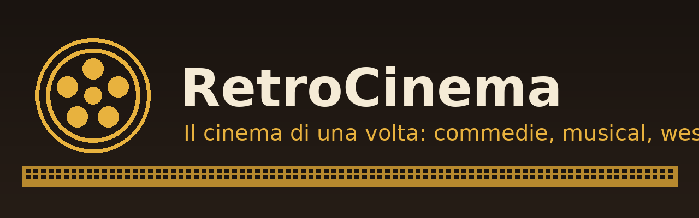

<p align="center">
  
</p>

# RetroCinema 🎞️

**Il cinema di una volta e i film di oggi, TUTTO IN ITALIANO, in UN SOLO plugin.** Estensione [CloudStream](https://github.com/recloudstream/cloudstream) curata per chi ama i film: i classici (Totò, Sordi, Gassman, Fellini, De Sica, Monicelli), il neorealismo, i melodrammi, le **storie d'amore**, i **film con i bambini** (anche tratti da libri), i **Grandi Classici su RaiPlay** e le **NUOVE USCITE ogni giorno** — **tutto gratuito, senza pubblicità e semplice da usare**.

Un solo plugin da installare, una sola home piena di film: le righe scorrono come le file di poster di Netflix — **e continuano a scorrere all'infinito mentre guardi**.

> ✅ **Tutti i film parlano ITALIANO** (o sono mute): ogni riga è costruita per garantire audio italiano.
> ✅ **Contenuti selezionati** — solo film adatti a tutta la famiglia.
> ✅ **SCROLL INFINITO OVUNQUE**: home e ricerca continuano a caricare nuovi film mentre scorri.
> ❌ **Niente film in inglese, niente horror, niente serie TV, niente contenuti adulti.**

---

## 📲 Installazione (3 minuti, una volta sola)

> Serve prima l'app **CloudStream** (versione *pre-release* consigliata): scaricala da [recloudstream.cloud](https://recloudstream.cloud) o dalle release GitHub ufficiali.

### Passo 1 — Apri le impostazioni
Nell'app tocca in alto a destra l'icona dell'**ingranaggio** ⚙️ (Impostazioni).

### Passo 2 — Vai su Estensioni
Tocca la voce **Estensioni** (o *Extensions*).

### Passo 3 — Aggiungi la repository
Tocca **Aggiungi repository** e incolla questo indirizzo esatto:

```
https://raw.githubusercontent.com/antonydp/retrocinema/main/repo.json
```

poi premi **Aggiungi repository** e attendi qualche secondo.

### Passo 4 — Installa RetroCinema
Nell'elenco compare **un solo plugin: RetroCinema**. Tocca **Installa** e poi **OK**.

### Passo 5 — Torna alla Home
Tocca il nome del fornitore in alto sulla home (o il pulsante delle categorie), scegli **RetroCinema**: le file di film d'epoca scorrono come su Netflix. 🍿

---

## 🏠 Cosa trovi in Home (28 righe, quasi tutte a scroll infinito)

| Riga | Contenuto |
|---|---|
| **Da vedere assolutamente** | I 16 migliori titoli: I soliti ignoti, Ladri di biciclette, Don Camillo, Il sorpasso, Fantozzi, C'eravamo tanto amati, Nuovo Cinema Paradiso… |
| **Nuove uscite: appena aggiunte** 🆕 | I film italiani aggiunti OGGI: ultime uscite al cinema e in TV, sempre aggiornate |
| **Storie d'amore** | C'eravamo tanto amati, L'eclisse, Cronaca di un amore, Nuovo Cinema Paradiso, Senso, Pane, amore e fantasia… |
| **Storie d'amore: sempre nuove** ♾️ | 2.000+ film romantici a scroll infinito (nuove uscite incluse) |
| **Film con i bambini** | Sciuscià, Ladri di biciclette, Miracolo a Milano, Prima comunione, Diario di un maestro… |
| **Dal libro al film (RaiPlay)** | 58 film tratti da grandi libri: Martin Eden, Hugo Cabret, Il cappotto di Astrakan… si aggiorna da solo |
| **Cinema ragazzi (RaiPlay)** | 43 film per (e con) i bambini: Fireheart, La casa del coccodrillo, Margot e il robot spaziale… |
| **Film di famiglia: sempre nuovi** ♾️ | 1.700+ film per la famiglia a scroll infinito |
| **Totò e i comici della risata** | Totò e le donne, Totò a colori, Dov'è la libertà?, Risate di gioia… |
| **Commedia all'italiana** | Sordi, Gassman, Manfredi, Monicelli, Risi, Germi, Comencini: Guardie e ladri, Divorzio all'italiana, Amici miei… |
| **Commedie moderne: sempre nuove** ♾️ | 6.000+ commedie a scroll infinito (audio italiano) |
| **Il grande cinema d'autore** | Fellini (Otto e mezzo, Amarcord, La strada), Visconti, Antonioni, Pasolini, Bertolucci… |
| **Neorealismo: l'Italia vera** | Roma città aperta, Paisà, Sciuscià, Umberto D., Riso amaro, Onorevole Angelina… |
| **Grandi melodrammi** | I lacrimogeni di Matarazzo: Catene, Tormento, Città dolente, Una donna libera |
| **Storie d'amore su RaiPlay** | La retrospettiva di Stefania Sandrelli: Divorzio all'italiana, Sedotta e abbandonata, Io la conoscevo bene… |
| **Stanlio e Ollio restaurati** | 26 film della coppia più amata, restaurati e in italiano (RaiPlay) |
| **Grandi classici di Hollywood (italiano)** | Su RaiPlay, doppiati in italiano: Gilda, Da qui all'eternità, Funny Girl… |
| **Il grande cinema su RaiPlay** | Il Gattopardo, La piscina, Gruppo di famiglia in un interno… |
| **Top 10 di oggi** 🆕 | I 10 film più visti sulla principale fonte italiana di streaming, aggiornati ogni giorno |
| **Grandi drammi: sempre nuovi** ♾️ | 8.000+ film drammatici a scroll infinito |
| **Avventure: sempre nuove** ♾️ | 1.800+ film d'avventura a scroll infinito |
| **Animazione: sempre nuova** ♾️ | 1.200+ film d'animazione a scroll infinito |
| **Peplum e avventura antica** | Maciste, Ercole alla conquista di Atlantide, Il colosso di Rodi |
| **Anni '70-'90: da ricordare** | Fantozzi, Un borghese piccolo piccolo, Johnny Stecchino, Febbre da cavallo, Il mostro |
| **Comiche senza parole** | Mute = nessuna lingua: Chaplin, Keaton, e i capolavori muti italiani L'Inferno e Cabiria |
| **25 anni di Rai Cinema (nuovi)** | Film italiani recenti (RaiPlay): I cento passi, Tutto il mio folle amore… si aggiorna da solo |
| **Film in esclusiva (nuove uscite)** | Le anteprime RaiPlay: 51 titoli recenti sempre aggiornati |
| **Scopri film sempre nuovi** ♾️ | Tutto il resto del catalogo verificato — scroll infinito, sempre nuovi titoli |

**114 film d'epoca verificati uno a uno** + **oltre 200 film RaiPlay** + **migliaia di film nuovi e recenti in italiano** dalla fonte FMHY più popolare — con **scroll infinito su tutte le righe marcate ♾️** (60 film a pagina, decine di pagine per genere) e sulle altre appena finiscono.

La **ricerca** parte dal catalogo italiano curato (istantanea), continua su StreamingCommunity (paginata) e Internet Archive, **caricando altri risultati mentre scorri**.

---

## 🆘 Problemi comuni

**"Non riesco ad aggiungere la repository"** — Alcuni gestori telefonici italiani bloccano gli indirizzi `raw.githubusercontent.com`. Attiva una **VPN qualsiasi** sul telefono solo per il momento in cui aggiungi la repository, poi la puoi disattivare.

**"Un film non parte"** — I titoli di RaiPlay vanno e vengono (i diritti scadono e ritornano). Prova un altro film della stessa riga: i cataloghi sono pieni. Su Internet Archive, se un film non parte prova il link con qualità più bassa (es. 480p).

**"Il plugin non si aggiorna"** — Nell'app: *Impostazioni → Estensioni → (tocco lungo su RetroCinema) → Aggiorna*. Gli aggiornamenti sono automatici di default.

---

## 🛠️ Per sviluppatori

### Struttura (template ufficiale [recloudstream/TestPlugins](https://github.com/recloudstream/TestPlugins))

```
retrocinema/
├── build.gradle.kts            ← configura i moduli (JitPack: com.github.recloudstream:gradle)
├── settings.gradle.kts         ← include automaticamente ogni cartella-plugin
├── repo.json                   ← il "catalogo" che l'app legge
├── .github/workflows/build.yml ← compilazione automatica a ogni push
└── RetroCinema/                ← UN solo modulo = UN solo plugin .cs3
    └── src/main/kotlin/com/retrocinema/
        ├── RetroCinemaProvider.kt   ← tutta la logica (home, ricerca, load, link)
        ├── ScSupport.kt             ← StreamingCommunity: sessione, DTO, estrattori VixCloud/VixSrc
        ├── Catalogo.kt              ← catalogo verificato generato da script
        └── RetroCinemaPlugin.kt     ← registrazione del provider
```

### Build automatica
Ogni push su `main`/`master` avvia **GitHub Actions**: il workflow esegue `./gradlew make makePluginsJson`, copia i `.cs3` e il `plugins.json` generato nel branch **`builds`**. Il `repo.json` punta lì: l'app scarica sempre l'ultima build, con **aggiornamento automatico** (basta incrementare `version` nel `build.gradle.kts` del modulo).

### Come sono scelti i contenuti
- **Catalogo ITALIANO verificato (114 film)**: sono ammessi SOLO film di origine italiana (audio italiano garantito) oppure comiche mute. Ogni film è stato controllato automaticamente via API `metadata` di Internet Archive: deve esistere, essere un film (mediatype movies), avere un file MP4/MKV riproducibile da ExoPlayer, una durata da lungometraggio e superare i filtri anti-horror/anti-adulti. Le versioni scelte provengono da uploader con `language=ita` esplicito o da release con traccia ITA; titoli e anni vengono puliti e riportati all'originale italiano.
- **RaiPlay** (legale, ufficiale, tutto in italiano): le righe usano le collezioni editoriali verificate `stanlioeollio-edizionirestaurate`, `grandiclassicidihollywood` (doppiati ITA), `ilgrandecinema` + **5 raccolte SSR** (Dal libro al film, Cinema ragazzi, 25 anni Rai Cinema, Film in esclusiva, Stefania Sandrelli): l'HTML pubblica le card con `data-layout="single"` (film) o `"multi"` (serie TV) — il plugin prende **solo i film** e scarta le serie. Si aggiornano da sole quando Rai cambia il catalogo. Gli item con genere *horror/erotico* vengono filtrati nel codice.
- **StreamingCommunity** (fonte FMHY, via `ScSupport.kt`): il porting del provider HadEnough di doGior (GPL-3.0), riadattato: **SOLO FILM** (filtro `type=="movie"` su tutte le righe e sulla ricerca), generi scelti per la famiglia (Romance, Family, Comedy, Drama, Adventure, Animation — **niente Horror**), slider ufficiali del sito per le **nuove uscite** e il **Top 10**. La sessione Inertia (cookie + XSRF + versione) è gestita automaticamente; il dominio viene **auto-rilevato** tra quelli attuali (streamingunity.win → .vip → streamingcommunityz.red) così il plugin continua a funzionare quando il sito cambia indirizzo. Lo stream passa dal player VixCloud con **CloudflareKiller** (bypass Cloudflare integrato in CloudStream) e fallback VixSrc.
- **Scroll infinito DAVVERO ovunque**: ogni riga paginata dichiara `hasNext=true` e risponde con la pagina successiva a ogni scroll (`getMainPage(page, request)`, fino a 60 pagine da 60 titoli per riga StreamingCommunity, paginator `current_page/last_page` reale); la riga "Scopri film sempre nuovi" pagina il catalogo verificato in memoria (24 film a pagina, zero rete); la ricerca usa `search(query, page)` con `SearchResponseList`.

### Note tecniche verificate sul campo (settembre 2026)
- **RaiPlay**: le collezioni hanno due forme (`contents[].contents[]` e `blocks[].sets[].path_id` → ContentSet JSON): il parser le attraversa entrambe in modo ricorsivo. Le **raccolte** (`/raccolta/*.html`) sono pagine SSR con card `card-item cell`: si estraggono `data-video-json` + `aria-label` + poster, filtrando `data-layout="single"` (= film singolo) e con cache in memoria per non rifare il fetch ~1 MB a ogni apertura home.
- **RaiPlay stream**: `/programmi/<slug>.json` → `first_item_path` → `/video/…json` → `video.content_url` (relinker) → `&output=71` = **playlist HLS m3u8**, con `Referer: https://www.raiplay.it` + **sottotitoli SRT italiani** da `subtitleList`.
- **Internet Archive stream**: NON si usa l'estrattore interno `archive.org/details` di CloudStream (ha un selettore CSS malformato e lascia il player in caricamento infinito). Il plugin chiama `metadata/<id>` e costruisce **link diretti** `https://<server><dir>/<file>` (solo MPEG4/H.264/Matroska/DivX, nomi URL-encoded, niente Ogg/Theora né duplicati "IA"), con fallback su `/download/` e **sottotitoli .vtt** dell'item passati via `subtitleCallback`.
- **StreamingCommunity stream**: `/it/iframe/<id>&canPlayFHD=1` → iframe `vixcloud.co/embed/<id>?token=…` → script con `window.masterPlaylist` (URL + token + expires, ripulito da regex e contatore graffe) → **m3u8** con `&h=1` per il FHD. Fallback: `vixsrc.to/movie/<tmdb_id>` con lo stesso parser. Da PC/server il player è dietro Cloudflare (403): sul telefono passa automaticamente via **CloudflareKiller**.
- **Paginazione**: `getMainPage(page, request)` con `hasNext=true` per lo scroll infinito per riga (l'app concatena gli item della pagina successiva nella stessa riga); `search(query, page)` sovrascritto con `SearchResponseList` per la ricerca a scroll infinito.
- **Ricerca RaiPlay**: la pagina SSR `ricerca.html` è stata dismessa (SPA); la ricerca parte dal catalogo locale, continua su StreamingCommunity e Internet Archive. Il catalogo RaiPlay resta raggiungibile dalle righe della home.

### Crediti e licenza
- Pattern del provider Internet Archive dal provider ufficiale di **Luna712** ([recloudstream/extensions](https://github.com/recloudstream/extensions)).
- Integrazione StreamingCommunity/VixCloud/VixSrc adattata dal provider **HadEnough** di **doGior** (GPL-3.0).
- Progetto rilasciato con **licenza GPL-3.0** (vedi `LICENSE`).

### Nota legale
Le estensioni funzionano come un normale browser: non ospitano alcun contenuto, si limitano a collegarsi a fonti che pubblicano i film legittimamente. **Internet Archive** (dominio pubblico) e **RaiPlay** (servizio pubblico Rai) sono fonti pubbliche, legali e gratuite. La fonte StreamingCommunity è elencata pubblicamente da FMHY; il plugin mostra solo titoli già pubblicati dal sito e nessun contenuto è ospitato in questa repository.
